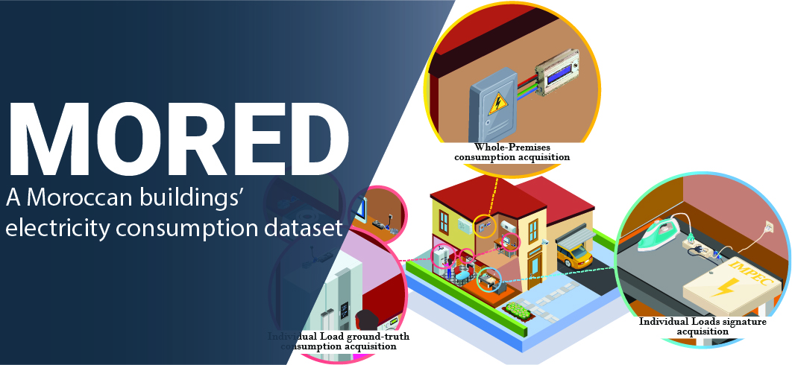

   
 

# Brief Description

Since spring  of  2019, a data acquisition campaign is being conducted to collect data reflecting the electricity consumption  of  different  urban  premises  in different Moroccan cities. MORED is the first open African dataset of buildings' electricity consumption. It contains labelled WP and IL ground-truth consumption data, labelled IL signatures, and WP consumption data of several Morccan households and Loads. The aim for providing such a dataset is to continue the progress that the field of energy disaggregation knew in the previous decade, by providing a dataset that has more data and utilises the field's recent advances.

MORED offers the following consumption data:
* Labelled WP and IL goround-truth electricity consumption
* WP electricity consumption
* IL signatures 

# Details about acquired data
## WP and ILGT data

|             | Properties | 1 | 2 | 3 | 4 | 5 | 6 | 7 |
| ----------  | ---------- | ---------- | ---------- | ---------- | ---------- | ---------- | ---------- | ---------- |
|**Premises**     | Affluent neighborhood apartment    | .          | .          | .          |   ✓        |         ✓ |          ✓ |          ✓ |
|             | Affluent neighborhood semi-detached house    | .          | ✓          |    .       |        .   |         . |          .  |          .  |  
|             | Disadvantaged neighborhood apartment    |        ✓   |          . |         ✓ |     .      |    .       |   .        |          .  | 
|             | City       | Sale       | Sale       | Sale       | Tetúan     | Rabat     | Tetúan      | Tetúan      |
|             | Number of occupants | 2         | 7        |  5   |     3  |   2         |     4         |     1         |
|             | Number of elderly (>65) |  0   |    0   |     0    |       0    |     0    |          0  |          0  |
|             | Number of adults (<65 and >18) |   2  |       4  |        4  |        3    |         2   |          3|          1|
|             | Number of rooms  |     5  |          5  |          5  |             5  |     5   |     6 |     3 |  
|             | Number of floors |  1     |     3       |   1         |    1   |   1   |       1 |       1 |
|             | Area (m2)  |     50  |     100   |    70     |  103   | 100   |       103 |       103 |
|             | Ownership  | R  |        B  |        R          |  B  |    R  | B | B |
|**WP measurements** | Sampling rate (S/s) | 1/5   |     1/5  | 1/5    |       1/5   |         1/5   |         1/5  |         1/5  |  
|             | Total acquisition duration (days) |     24 |         14 |         80 |            60 |             44 |             40 |             90 |  
|             | Mean daily consumption (kW)    | 110     | 115   |   220     |    281      |    280    |      295|      206|
|**IL ground-truth measurements** | Sampling rate (S/s) |1/5   |   1/5   |   1/5 | 1/5   |   1/5  |        1/5|        1/5|
|             | Total number of monitored Loads | 8      |3   |       3   |          4  |            7  |            3|            2|

## WP data

| Properties | Premises 1 | Premises 2 | Premises 3 | Premises 4 | Premises 5 | Premises 6 | Premises 7 |
| ----------  | ---------- | ---------- | ---------- | ---------- | ---------- | ---------- | ---------- |
| Affluent neighborhood apartment     |      .     |        .   |          .  |   .       |      .     |        .    |         ✓ |
| Affluent neighborhood semi-detached house      |     .      |       .    |         .    |         . |       .   |         ✓   |          .|
| Disadvantaged neighborhood apartment      |      ✓    |          ✓  |            ✓ | ✓        |      ✓   |           .  | .   |
|City of residence | Sale   |    Sale  |     Sale  |     Sale  |     Sale |     Sale |     Tetúan |
|Number of occupants     | 2    |        3  |          8  |          4       |     2    |        2   |          3|
|Number of elderly (>65)  | 0        |    0     |       0    |        0    | 2   |         0 |            0|
|Number of adults (<65 and >18)      |    2   |         3  |          5   |         4   |         0   |        2   |          3|
|Number of rooms  |5       |     5        |    5    |        5  |          5 |           5  |           3|
|Number of floors  |1         |   1    |        1  |          1  | 1   |         2  |           1|
|Area (m2)  | 50         | 50    |      50  |        50  |   50   |     100  |       103|
|Ownership  | R      |      R   |         R   |         R  |      R       |    B   |          B|
|Sampling rate (S/s) |                             1/10  |    1/10  |    1/10    |  1/10   |   1/10  |   1/5   |      1/5 |
|Total duration (days) |   45    |      80  |        36  |   33    |      28     |     82    |       15|
|Mean daily consumption (kW)   |      110   |     115    |    220   |     281    |     28    |    187  |   227|

## ILS data

| Load | Premises 1 | Premises 2 | Premises 3 | Premises 4 | Laboratory | #Brand | Consumption type | #Takes|
| ---- | ----       | ----       | ----       | ----       | ----       | ----   | ----             | ----  |
|Blender|  ✓| ✓ |✓ |✓ |. |4 |FSM |1UI |40|
|Hair dryer | ✓ | ✓ | . | ✓ | . | 3 | FSM | 1UI | 30|
|Laptop | ✓ | . | . | . | . | 2 | CVD | 1UI | 21|
|Kettle | . | . | . | ✓ | . | 1 | ON/OFF | 1UI | 10|
|Hand mixer | . | . | . | ✓ | . | 1 | FSM | 1UI | 10|
|Stand mixer | . | . | . | ✓ | . | 1 | FSM | 1UI | 10|
|Toaster | . | . | . | ✓ | . | 1 | ON/OFF | 1UI | 10|
|Monitor |  ✓   |  .   |  .   |  .   |  .   |  1   |  CVD   |  1UI   |  10|
|Panini grill | ✓ | ✓ | . | . | . | 2 | ON/OFF | 1UI | 20|
|Refrigerator | ✓ | ✓ | ✓ | . | . | 3 | CVD | 1UI | 31|
|Space heater | ✓ | . | . | . | . | 1 | ON/OFF | 1UI | 10|
|Washing machine | ✓ | . | ✓ | . | . | 2 | CVD | 1UI | 21|
|WIFI fiber adapter | ✓ | . | . | . | . | 1 | ON/OFF | 1UI | 12|
|WIFI modem | ✓ | . | . | . | . | 1 | ON/OFF | 1UI | 10|
|Curling brush | . | ✓ | . | . | . | 1 | ON/OFF | 1UI | 10|
|Hair curler | . | ✓ | . | . | . | 1 | ON/OFF | 1UI | 10|
|Hair straightener | . | ✓ | . | . | . | 1 | ON/OFF | 1UI | 10|
|Ironing machine | ✓ | ✓ | . | . | . | 2 | ON/OFF | 1UI | 20|
|Oven | . | ✓ | ✓ | . | . | 2 | FSM | 1UI | 20|
|Vacuum cleaner | . | ✓ | . | . | . | 1 | ON/OFF | 1UI | 10|
|Water heater | . | ✓ | ✓ | . | . | 2 | ON/OFF | 1UI | 20|
|PS3 | . | . | ✓ | . | . | 1 | CVD | 1UI | 10|
|TV | . | . | ✓ | . | . | 1 | CVD | 1UI | 10|
|3D printer | . | . | . | . | ✓ | 1 | CVD | 1UI | 10|
|Band saw | . | . | . | . | ✓ | 1 | CVD | 1UI | |
|Desktop computers | . | . | . | . | ✓ | 1 | CVD | 1UI| 1|
|Drill press | . | . | . | . | ✓ | 1 | CVD | 1UI | 10|
|Drilling machine | . | . | . | . | ✓ | 1 | CVD | 1UI| 10|
|Fan heater | . | . | . | . | ✓ | 1 | CVD | 1UI | 10|
|Heat gun | . | . | . | . | ✓ | 1 | CVD | 1UI | 10|
|Immersion heater | . | . | . | . | ✓ | 1 | CVD | 1UI | 10|
|Impact drill | . | . | . | . | ✓ | 2 | CVD | 1UI |21|
|Jigsaw | . | . | . | . | ✓ | 1 | CVD | 1UI | 10|
|Metal cutting saw | . | . | . | . | ✓ | 1 | CVD | 1UI | 10|
|Paint curing lamp | . | . | . | . | ✓ | 1 | CVD | 1UI| 10|
|Sling miter saw | . | . | . | . | ✓ | 1 | CVD | 1UI | 10|
|Combined grinder & polisher | . | . | . | . | ✓ | 1 | CVD | 3UI | 10|

# DOWNLOAD
## **WPILGT data**
  * _Apartment in a disadvantageous neighbourhood_
    * [Premises 1](https://drive.google.com/drive/folders/1zWr04V7ep8GxawXsVvhh4MdIZwq5X_d7?usp=sharing)
    * [Premises 3](https://drive.google.com/drive/folders/1HaGMTDxbNj6zcs-ZGN06uXtWrteH0rGk?usp=sharing)
    * [Premises 7](https://drive.google.com/drive/folders/14N0al7aUt3pxcO_GbM8CXc27DAAL0xEX?usp=sharing)**`new`**
    * [Premises 10](https://drive.google.com/drive/folders/12qkV7gFXmj6anjVuyd5BFbtsfhv2rmyH?usp=sharing)**`new`**
  * _Semi-Detached House in an affluent neighbourhood_
    * [Premises 2](https://drive.google.com/drive/folders/1KqjpGxbDYH_Qa24in1cXaFyihwhUl5y7?usp=sharing)
    * [Premises 9*](https://drive.google.com/drive/folders/14Ymk9jJTxjX4IzzKSJQ1AgL8oNwUi_Sq?usp=sharing)**`new`**
  * _Apartment in an affluent neighbourhood_
    * [Premises 4](https://drive.google.com/drive/folders/1VRsbqt2ho62IFW1PAfGASWvWEomfM12l?usp=sharing)
    * [Premises 5](https://drive.google.com/drive/folders/1jfJSoQrNkPHKF08UhJvUbn33A0cPpByF?usp=sharing)
    * [Premises 6](https://drive.google.com/drive/folders/1KSk8HO0wgxMvQxkfyY1Pf7NlRbnUSyvb?usp=sharing)
    * [Premises 8](https://drive.google.com/drive/folders/1HMDZo8jD5cImA-7X6zui0o0Mv12F3fvK?usp=sharing)**`new`**
  * [_metadata_](https://drive.google.com/drive/folders/1ylZD7F0xMY5DZSpDUPNXyx-cZSdbE43e?usp=sharing)

*: The data desciribing the whole-house electricity consumption of this household is not available.  

## **WP data**
  * _Apartment in a disadvantageous neighbourhood_
    * [Premises 1](https://drive.google.com/file/d/1V9t0CF1re0DFHXqDDa9hba87DNaB3Nvm/view?usp=sharing)
    * [Premises 2](https://drive.google.com/file/d/1Th8jFVNpv2K-81KezYgHJSmvq93jNl7i/view?usp=sharing)
    * [Premises 3](https://drive.google.com/file/d/1H8_IHfaVBkwfahQpqUzlHbbPLfDBMmhN/view?usp=sharing)
    * [Premises 4](https://drive.google.com/file/d/1niSxTd3dfrNKo9w4-S41XtU1_bF-br73/view?usp=sharing)
    * [Premises 5](https://drive.google.com/file/d/1J1Eu2VfMRNQKxOlRmF3FY6Z_ZjHcW5TW/view?usp=sharing)
    * [Premises 8](https://drive.google.com/file/d/1OC9vEv-bknnaEzVSKxMKhagrsUBfNVAh/view?usp=sharing)**`new`**
    * [Premises 12](https://drive.google.com/file/d/1YTTLcsexpEEOlo7QShtRXe2qUbBPGBFB/view?usp=sharing)**`new`**
  * _Semi-Detached House in an affluent neighbourhood_
    * [Premises 6](https://drive.google.com/file/d/1ept4Kbbei_czsGdMwCbg59bS2biBlhlx/view?usp=sharing)
  * _Apartment in an affluent neighbourhood_
    * [Premises 7](https://drive.google.com/file/d/17QD-xWMORwvNKV6gZhhFSOymRbuPCx5R/view?usp=sharing)
    * [Premises 9](https://drive.google.com/file/d/13PsJ0eR-CJHnPUkQAdVzD6jerjuLaGrW/view?usp=sharing)**`new`**
    * [Premises 10](https://drive.google.com/file/d/14kHxrpSHk8_m8k1eRTfmNBi9pzPEmS6r/view?usp=sharing)**`new`**
    * [Premises 11](https://drive.google.com/file/d/1U-MKHjauD9IJUVv_a0-WZQFkVJ9AfSTV/view?usp=sharing)**`new`**
  * [_metadata_](https://drive.google.com/drive/folders/17HL1gYyvW8oO2wiG5mDLct3lFGZcXune?usp=sharing)  

## **ILS data**
   * [all loads (50Hz and 4Hz)](https://uirabat-my.sharepoint.com/:f:/g/personal/aymane_ahajjam_uir_ac_ma/ErK9uq8SD11IgljlnxX61LoBVzUZwLd_lqgfWdAaCCGcCA?e=iQJZyC)

# Reference
For more information about the dataset, please refer to (and cite) the following paper:
Ahajjam, M.A.; Bonilla Licea, D.; Essayeh, C.; Ghogho, M.; Kobbane, A. [MORED: A Moroccan Buildings’ Electricity Consumption Dataset.](https://doi.org/10.3390/en13246737) Energies 2020, 13, 6737.

BIBTEX:
> @article{Ahajjam_2020, title={MORED: A Moroccan Buildings’ Electricity Consumption Dataset}, volume={13}, ISSN={1996-1073}, url={http://dx.doi.org/10.3390/en13246737}, DOI= {10.3390/en13246737}, number={24}, journal={Energies}, publisher={MDPI AG}, author={Ahajjam, Mohamed Aymane and Bonilla Licea, Daniel and Essayeh, Chaimaa and Ghogho, Mounir and Kobbane, Abdellatif}, year={2020}, month={Dec}, pages={6737}}

We appreciate all the residents who have accepted us in their households and collaborated with us to collect MORED.    :raised_hands: THANK YOU! :raised_hands:

